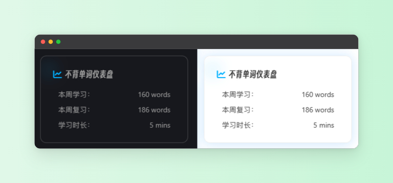

## 特别感谢

基于`left0ver`大佬开源项目[github-bbdc-stat](https://github.com/left0ver/github-bbdc-stat)修改的hexo，侧边栏不背单词仪表盘

## 效果展示

左右分别为hexo昼夜模式效果，使用的样式为hexo-butterfly主题自带的**网站资讯**模块的样式，butterfly主题不用引入其他样式



## 使用方法

在 `blog` >  `source` > `_data` > `widget.yml `添加内容，下面示例

把 **userID** 改成自己的

> userId是你的不背单词的ID,**查看方法：进入不背单词app首页，点击左上角的头像，再点击右上角的设置，往下拉到最底下即可看到你的ID(必填)**

```
#top: 创建的 widget 会出现在非 sticky 区域（即所有页面都会显示)
#bottom: 创建的 widget 会出现在 sticky 区域（除了文章页都会显示)
top:
  - class_name: card-webinfo
    id_name:
    name: 不背单词仪表盘
    icon: fas fa-chart-line
    html: '<script type="text/javascript"src="https://bbdc.good.gq/bbdc?userId=32822769"></script><script> bbdc() </script>'

bottom:
  # - class_name:
  #   id_name:
  #   name:
  #   icon:
  #   order:
  #   html:
```

